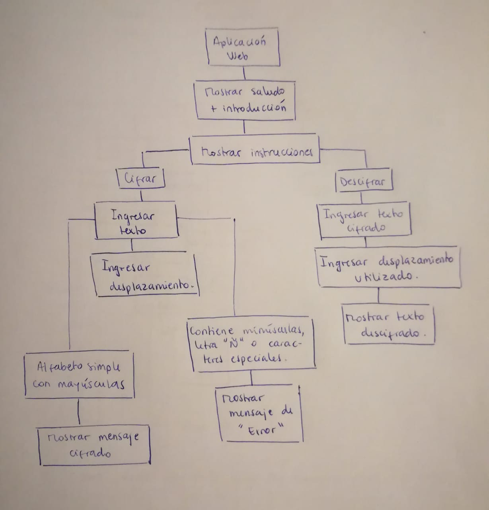
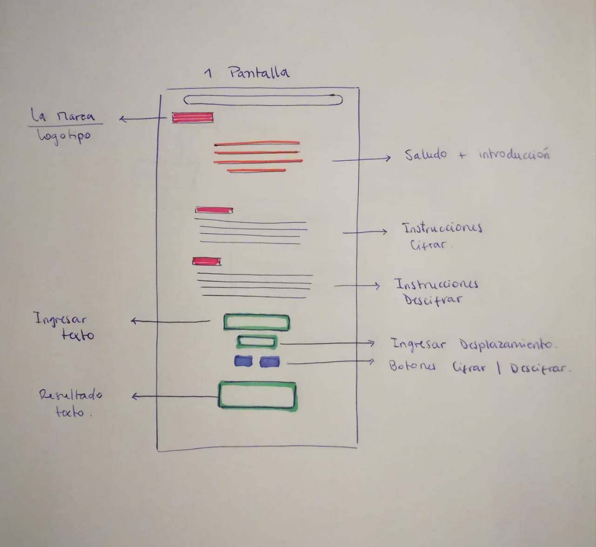

# CRIPTAPP

**CRIPTAPP** es una aplicación web que permite convertir un texto a mensaje confidencial, reemplazando cada letra por una distinta. Esta aplicación se desarrolla a partir de la necesidad que surge en reuniones de directorio, ya sea de bancos u otras instituciones, para mantener sus apuntes en secreto y así conservar la seguridad de la información que se mencione en cada uno de estos eventos.

## ¿Dónde encontrar Criptapp?
La aplicación se encuentra disponible en la web, sólo debes abrir el navegador de tu computador o dispositivo móvil e ingresar a la página a través del siguiente link:

https://natalie-veloso.github.io/scl-2018-11-bc-core-cipher/index.html

#### ¿Cómo transformar un texto?

- Ingresa texto que quieres transformar en la caja **Ingresar Texto**.

- **Escribe sólo en MAYÚSCULA, no utilices letra Ñ, números, ni caracteres especiales.**

- Ingresa un número en la caja **Ingresar Desplazamiento**, que corresponderá a la posición que te desees desplazar para reemplazar las letras.

- Pincha el botón **Cifrar** y aparecerá tu texto confidencial en la caja de **Resultado**.

#### ¿Cómo leer un mensaje secreto?

- Ingresa el **número de desplazamiento** que ocupó la persona que transformó el mensaje, este se debe escribir en la caja **Ingresar Desplazamiento**.

- Pincha el botón **Descifrar** y aparecerá tu texto descifrado en la caja de **Resultado**.

## Funcionalidad

Esta aplicación se basa en un método llamado **Cifrado César**, el cual permite (mediante una fórmula) convertir un texto a mensaje secreto, indicando un número y así reemplazar cada letra por una distinta, según la posición que ocupe esa letra dentro del abecedario. Para su desarrollo se utilizó lenguaje JavaScript (ES6), HTML5 y CSS.

#### Ejemplo
Ingresamos un texto con las letras _"ABC"_, indico número 3 (cuántas posiciones quiero que se mueva) y reemplazará estas letras por _"CDE"_ (posición 3,4,5 del abecedario).

## Decisiones de Diseño

### Planificación
Para comenzar un proyecto se requiere organización de las tareas a realizar, puedes visitar el siguiente link para observar la planificación:

https://trello.com/b/I4QBkpni/proyecto-1

### Marca
El nombre de esta aplicación es una fusión entre las palabras **criptograma** _(documento escrito en clave | Pasatiempo que consiste en descifrar un texto cifrado averiguando su clave)_ y **aplicación**.

### Diagrama de Flujo
Describe el proceso que seguirá la aplicación.

### Pantallas
Se define sólo una pantalla para visualizar la aplicación, ya que de esta forma el usuario podrá acceder rápidamente a las instrucciones en caso de que las haya olvidado.

Dentro de ella se considera:

- Logotipo.

- Saludo de bienvenida e información sobre la aplicación.

- Instrucciones de Cifrado.

- Instrucciones de Descifrado.

- Caja para ingresar texto.

- Caja para ingresar desplazamiento.

- Botón para Cifrar y otro para Descifrar.

- Caja para ver texto cifrado o descifrado.

## Colores
Los colores utilizados son en tonos azules, ya que se caracterizan por transmitir seguridad y confianza.

## Actualización
Pronto podrás ver las mejoras y actualizaciones realizadas en la aplicación.